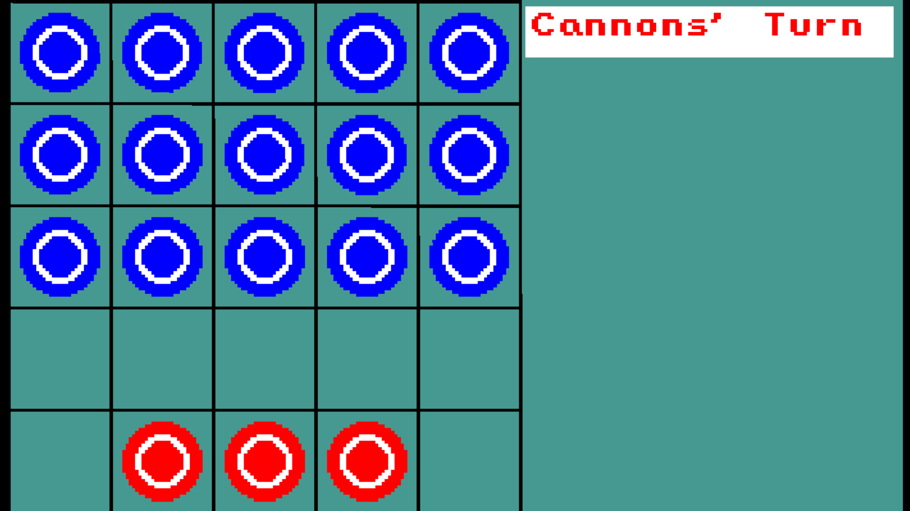

# Three Cannons, Fifteen Soldiers (Chinese: 三炮十五兵)

A traditional Chinese strategy board game implemented in three different programming languages: VB.NET, Python, and Ruby. It is yet another demonstration of cross-language game development.



## Game Overview

_Three Cannons, Fifteen Soldiers_ is a classic turn-based strategy game played on a 5x5 grid. The game features two types of pieces:
- **15 Soldiers** (blue) - positioned on the top 3 rows
- **3 Cannons** (red) - positioned on the bottom row

## Game Rules

### Objective
- **Cannons Win**: Reduce the number of soldiers to 3 or fewer
- **Soldiers Win**: Block all cannons from being able to move

### Movement
- **All Pieces**: Can move one square orthogonally (up, down, left, right) to an empty square
- **Cannons Special Ability**: Can jump over one empty square to capture a soldier two squares away in a straight line

### Turn Order
1. Cannons move first
2. Soldiers move second
3. Turns alternate until a winner is determined

## Screenshots

### Game Board
- Teal background with 5x5 black grid
- Blue circles represent soldiers
- Red circles represent cannons
- Yellow highlights indicate selected pieces and valid moves

### Status Display
- Shows current turn (Cannons' Turn or Soldiers' Turn)
- Displays winner when game ends
- Provides restart instructions

## Implementations

### VB.NET
- Uses the VbPixelGameEngine library
- Located in `Program.vb`
- Built with [.NET SDK 9.0+](https://dotnet.microsoft.com/download/dotnet/9.0)

### Python
- Uses the Pygame library
- Located in `cannons_soldiers.py`
- Requires Python 3.11+

### Ruby
- Uses the Ruby2D library
- Located in `cannons_soldiers.rb`
- Requires Ruby 2.7+

## How to Run
First, clone this repository and navigate to the project directory:
```bash
git clone https://github.com/Pac-Dessert1436/Three-Cannons-Fifteen-Soldiers.git
cd Three-Cannons-Fifteen-Soldiers
```

### VB.NET
```bash
# Restore project dependencies
dotnet restore

# Build and run using .NET CLI
dotnet run
```

### Python
```bash
# Install dependencies (if needed)
pip install pygame

# Run the game
python cannons_soldiers.py
```

### Ruby
```bash
# Install dependencies
gem install ruby2d

# Run the game
ruby cannons_soldiers.rb
```

## Controls

### Mouse
- **Left Click**: Select a piece or move to a valid square

### Keyboard
- **R**: Restart the game
- **ESC**: Exit the game

## Features

### All Versions
- Complete implementation of game rules
- Visual feedback for selected pieces and valid moves
- Turn-based gameplay with status display
- Game over detection with winner announcement
- Restart functionality

### Visual Enhancements
- Color-coded pieces (red cannons, blue soldiers)
- Yellow selection highlights
- Status text with current turn/winner
- Instructions for restarting

## Gameplay Tips

### Cannons Strategy
- Use your special jumping ability to capture soldiers from a distance
- Focus on reducing the soldier count to 3 or fewer
- Move strategically to maintain mobility

### Soldiers Strategy
- Work together to block cannon movement
- Try to surround cannons to limit their options
- Maintain your numbers above 3 to avoid losing

## Technical Details

### Board Representation
- 5x5 grid represented as a 2D array
- Piece values: 0 (Empty), 1 (Soldier), 2 (Cannon)
- Game state tracking: 0 (Game Over), 1 (Cannons' Turn), 2 (Soldiers' Turn)

### Movement Validation
- Orthogonal adjacency check for regular moves
- Special cannon movement validation for jumps and captures
- Turn-based validation to ensure correct player moves

## License
This project is licensed under the MIT License. See the [LICENSE](LICENSE) file for details.
